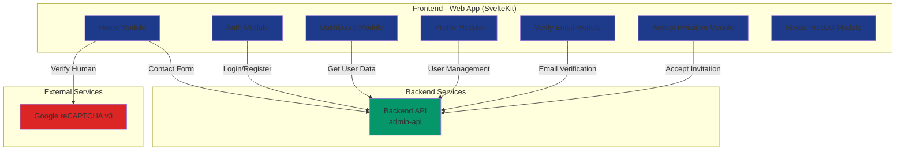

# Module Dependency Documentation

These documents describe which APIs are consumed by each application module and how they interact at runtime.

This documentation supports C4 container and component diagrams.

---

## 📋 Resumen de Dependencias

### APIs Externas

| API/Servicio | Tipo | Módulos Consumidores |
|-------------|------|---------------------|
| Backend API (admin-api) | REST API | auth, dashboard, profile, accept-invitation, verify-email |
| Google reCAPTCHA v3 | Third-party Service | home (contact form) |

### Endpoints Backend API

| Endpoint | Método | Módulos que lo usan |
|---------|--------|---------------------|
| `/api/v1/auth/login` | POST | auth |
| `/api/v1/auth/refresh` | POST | auth (token refresh) |
| `/api/v1/auth/forgot-password` | POST | auth |
| `/api/v1/auth/reset-password` | POST | auth |
| `/api/v1/auth/password` | PATCH | profile |
| `/api/v1/clients` | POST | auth (registro) |
| `/api/v1/clients` | GET | auth |
| `/api/v1/auth/verify-email` | POST | verify-email |
| `/api/v1/auth/resend-verification` | POST | auth |
| `/api/v1/users/me` | GET | profile, dashboard |
| `/api/v1/users` | GET | profile |
| `/api/v1/users/accept-invitation` | POST | accept-invitation |
| `/api/v1/contact/send-message` | POST | home (landing page) |

---

## 📁 Módulos Documentados

- [auth.md](./auth.md) - Autenticación y registro de usuarios
- [dashboard.md](./dashboard.md) - Panel de control principal
- [profile.md](./profile.md) - Gestión de perfil de usuario
- [home.md](./home.md) - Página de inicio y contacto
- [verify-email.md](./verify-email.md) - Verificación de correo electrónico
- [accept-invitation.md](./accept-invitation.md) - Aceptación de invitaciones
- [products-nexus.md](./products-nexus.md) - Página de producto Nexus

---

## 🏗️ Arquitectura General

---

## 🔑 Configuración

La configuración de las APIs se encuentra centralizada en:
- **Archivo**: [`src/lib/config/api.js`](file:///home/chch/Code/geminis-labs-web-page/src/lib/config/api.js)
- **Variable de entorno**: `VITE_API_BASE_URL`
- **Fallback**: `http://127.0.0.1:8000`

---

## 📝 Notas

- Todos los módulos autenticados requieren tokens JWT (access_token e id_token)
- Los tokens se almacenan en `sessionStorage` para mayor seguridad
- El cliente API centralizado está en [`src/lib/services/apiClient.js`](file:///home/chch/Code/geminis-labs-web-page/src/lib/services/apiClient.js)
